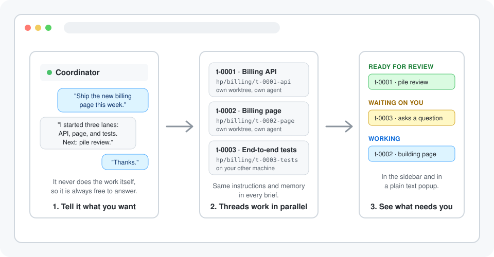

<p align="center"></p>

<h3 align="center">Run a whole project across your coding agents without handing each one its task or keeping track of who is doing what</h3>

<p align="center">Herdr ADE lets you run a larger piece of work in <a href="https://herdr.dev">Herdr</a> when one agent isn't enough and managing five by hand is a job in itself, by giving you one coordinator conversation that starts a separate agent for each task on its own branch, gives every one of them the same instructions and memory, and shows you which threads are ready for review, waiting on you, or still working.</p>

<p align="center"></p>

<p align="center"><a href="https://github.com/uguryildirim24/herdr-ade/blob/main/docs/getting-started.md"></a></p>

<p align="center"><sub>✓&nbsp;Free,&nbsp;MIT&nbsp;licensed &nbsp; ✓&nbsp;Lane&nbsp;work&nbsp;runs&nbsp;on&nbsp;your&nbsp;machines &nbsp; ✓&nbsp;macOS&nbsp;and&nbsp;Linux,&nbsp;Herdr&nbsp;0.9.1+</sub></p>

<br />

## Keep one conversation going while the work happens in parallel

The coordinator never does the work itself, so it's always free to answer you. Each task runs in its own thread: a separate agent in a git worktree tab under the coordinator, or in its own tab folder when there is no repository. You read reports and answer the threads that need you instead of briefing every agent yourself.

## Choose between briefing each agent by hand, one long agent session, a cloud projects product, or a coordinator in Herdr

| | **Herdr ADE** | Briefing agents by hand | One long agent session | Cloud projects products |
|---|:---:|:---:|:---:|:---:|
| **No extra software fee** | ✅ | ✅ | ✅ | ❌ |
| **Parallel tasks on separate branches** | ✅ | ✅ | ❌ | ✅ |
| **Same instructions and memory for every task** | ✅ | ❌ | ✅ | ✅ |
| **One conversation that stays free to answer** | ✅ | ❌ | ❌ | ✅ |
| **Threads grouped by what needs you** | ✅ | ❌ | ❌ | ✅ |
| **Runs on your own machines** | ✅ | ✅ | ✅ | ❌ |
| **Adopts an agent pane you already started** | ✅ | ✅ | ❌ | ❌ |
| **Works with the agent CLI you already use** | ✅ | ✅ | ✅ | ❌ |
| **Runs with no machine of yours switched on** | ❌ | ❌ | ❌ | ✅ |

Keep your attention on decisions. Herdr ADE starts and tracks the threads, your agents do the work, and you choose what to review, answer, or merge.

## Tell the coordinator what you want. See which thread needs you in the sidebar.

### 📈 See every thread at a glance

Each thread shows its project, its id and its group beside its session: `ready-for-review`, `waiting-on-you`, `working`, `landing` or `idle`. One action filters the sidebar to a single project, with the coordinator first and finished work next, and a text popup prints the same groups.

### ⚡ Stop briefing every agent yourself

Say what you want once. The coordinator proposes threads and waits for your go-ahead, then each thread starts from a brief with your standing instructions, the project's memory and its task. Lessons a thread reports under `## Remember` flow back into memory for the next one.

### 💬 Know when a thread needs an answer

A thread that waits on a permission prompt for more than 30 seconds moves to Waiting on you, and a finished one stays under Ready for review until you've looked. A background ticker follows pull requests and runs your scheduled routines. The coordinator reads thread, round, and courier event facts directly; its inbox holds messages such as routine runs, not copies of those facts.

## Open your first project in three steps

<table>
<tr>
<td align="center" valign="top" width="33%"><h3>1️⃣</h3><b>Install the plugin</b><br /><sub>Run <code>herdr plugin install uguryildirim24/herdr-ade</code>. The plugin builds itself with Cargo. You'll need access to the private repository.</sub></td>
<td align="center" valign="top" width="33%"><h3>2️⃣</h3><b>Create and open a project</b><br /><sub>Run the <b>Projects: new project</b> action, or <code>herdr-ade new "Billing" --repo ~/dev/app</code> then <code>herdr-ade open billing</code>. A coordinator agent starts in its own workspace.</sub></td>
<td align="center" valign="top" width="33%"><h3>3️⃣</h3><b>Tell it what you want</b><br /><sub>Describe the work in the coordinator's pane. It suggests threads, you say go ahead, and the sidebar shows each thread's group as it works.</sub></td>
</tr>
</table>

## Get everything included, free

<table align="center">
<tr>
<td align="center" valign="top"><sub>For developers who run coding agents in Herdr on macOS or Linux</sub><br /><h2>Free</h2><div align="left">&nbsp;&nbsp;&nbsp;✓&nbsp; A coordinator that delegates and never does the work itself<br />&nbsp;&nbsp;&nbsp;✓&nbsp; Threads on their own worktree and branch, or in a tab<br />&nbsp;&nbsp;&nbsp;✓&nbsp; Shared instructions and memory in every brief<br />&nbsp;&nbsp;&nbsp;✓&nbsp; Overview by what needs you, in the sidebar and as text<br />&nbsp;&nbsp;&nbsp;✓&nbsp; Pull request follow-up, routines and watched commands<br />&nbsp;&nbsp;&nbsp;✓&nbsp; Threads on your saved SSH machines, reports copied home</div></td>
</tr>
<tr>
<td align="center"><a href="https://github.com/uguryildirim24/herdr-ade/blob/main/docs/getting-started.md"></a></td>
</tr>
</table>

## Get your questions answered

### Do I need to know how to code?

You need to be comfortable in a terminal. The plugin builds itself on install, and a project is a plain folder of Markdown and TOML files. You'll need macOS or Linux, Herdr 0.9.1 or newer, Rust/Cargo, Git, and an agent CLI Herdr can start, such as Claude Code. The [getting-started guide](docs/getting-started.md) covers the prerequisites.

### How do I check that Herdr ADE is running?

Run:

```bash
herdr plugin action invoke doctor --plugin herdr-ade
```

The command checks the Herdr version, the tools it calls, the ticker, and each project's session. The [getting-started guide](docs/getting-started.md#check-your-setup) walks through a project that won't open, a thread that doesn't start, and a ticker that isn't running.

### What permissions does the coordinator need?

It runs the `herdr-ade` binary every turn, so you'll want to allow-list it in your agent **by subcommand, never the bare binary**. Allow reading and steering (`skill`, `context`, `inbox done`, `thread list`, `thread prompt` and the like) and leave `thread resolve`, `delete`, `routine approve` and `open` on your agent's normal permission prompt. Leave `thread start` off the list too unless you've set `start_threads = "auto"`: then every thread start is a real confirmation. [Operations](docs/operations.md#the-allow-list-for-your-coordinator) has the exact patterns.

### Does the plugin send my project to a hosted service?

Project files and lane work stay on your machines. Dispatch reads the local routing table; only the selected agent CLI uses its configured service. Remote lanes use your own SSH machines.

### Will it touch my branches or worktrees on its own?

It never deletes a branch, merges or pushes on its own. An ADE lane is `git worktree add` into `<repo>/.worktrees/<id>` plus a tab in the coordinator workspace. `thread resolve` removes the worktree without force after its files are copied and its commits have landed or its round has closed; uncommitted changes keep the worktree with a reported reason. The branch is retained. Deleting a project moves its folder to a trash folder and leaves every worktree and branch alone.

### What is `--plain`?

A birth sentence. `thread start` and `thread adopt` require `--plain`. The sentence must pass the plugin's plain-language check (one sentence, known words). Recipe choice comes from the editable `[routing]` table in `config.toml`; `thread start` rejects model, recipe and role flags. Adoption's `--role` only labels the existing workflow; `--passive` sets the parent token and sends no primer. See [task-based routing](docs/operations.md#task-based-routing).

### Where does my project live?

In `~/.herdr-ade/<name>/` by default: `PROJECT.md` for your settings and standing instructions, `MEMORY.md` and `memory/` for what the coordinator remembers, `TASKS.md` for the task list the coordinator keeps for you, `threads/` for thread records and reports, and `library/` for files threads produced. The safety settings live outside it, in `~/.config/herdr-ade/config.toml`, where no agent works. [Operations](docs/operations.md#where-things-live) lists every file.

### Do I have to start every thread through the coordinator?

No. Run `herdr-ade thread start` yourself, or take an agent pane you already started and make it a thread with `thread adopt`. The **Projects: continue this workspace as a project** action turns the workspace you're in into a project with its agent as the first thread.

### What if the safety settings aren't enough?

They are soft. By default the coordinator proposes threads and waits, thread agents keep their normal permission prompts, and routines may not run shell commands until you enable them and approve each command in a terminal. But agents have a shell: one that runs with skip-permission arguments can edit those files, a thread can prompt the coordinator pretending to be you, an approved routine command covers its text and not the scripts it calls, and whatever reaches memory is repeated in every later brief. [Operations](docs/operations.md#what-the-safety-settings-do-and-dont-stop) says plainly what each guard stops and what it doesn't.

### What does it cost?

Herdr ADE is free and [MIT licensed](LICENSE). You need access to the private repository to install it. Your agent CLI's usual usage charges still apply: every thread is a full agent session, and the coordinator spends tokens each turn reading its digest.

## Open your first project in three steps

<p align="center">Your first project starts with an install, a name, and one sentence about what you want. Herdr ADE starts the threads and keeps them in view. You choose what to review and what to merge.</p>

<p align="center"><a href="https://github.com/uguryildirim24/herdr-ade/blob/main/docs/getting-started.md"></a></p>

<p align="center"><sub>✓&nbsp;Free,&nbsp;MIT&nbsp;licensed &nbsp; ✓&nbsp;Lane&nbsp;work&nbsp;runs&nbsp;on&nbsp;your&nbsp;machines &nbsp; ✓&nbsp;macOS&nbsp;and&nbsp;Linux,&nbsp;Herdr&nbsp;0.9.1+</sub></p>
